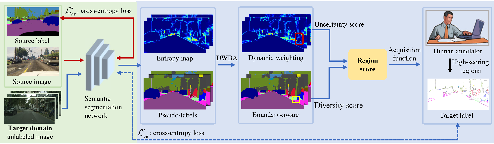

<div align="center"> 

# Dynamic Weighting and Boundary-Aware Active Domain Adaptation for Semantic Segmentation in Autonomous Driving Environment
by [Licong Guan](https://licongguan.github.io/), Xue Yuan

</div>

This repository provides the official code for the paper "Dynamic Weighting and Boundary-Aware Active Domain Adaptation for Semantic Segmentation in Autonomous Driving Environment"

:sparkles: **Abstract** 

>Semantic segmentation techniques play a crucial role in autonomous driving systems, especially in accurately parsing the environment and ensuring safe decision-making. Despite significant progress in this technology, challenges remain in terms of the cost of labeling data and the adaptability of the model when deployed to multiple target domains. Active Domain Adaptation (ADA) techniques integrate active learning and domain adaptation to adapt models from the source domain to the target domain while actively selecting the most helpful samples for labeling. However, current ADA approaches still face challenges in exploring more efficient sample selection mechanisms and mitigating data imbalance problems. This study proposes an innovative framework: Dynamic Weighting and Boundary-Aware Active Domain Adaptation (DWBA-ADA) to enhance cross-domain semantic segmentation in an autonomous driving environment. The framework emphasizes the simultaneous use of uncertainty and diversity information to identify critical image regions. The framework is improved in two ways: first, increasing the sampling proportion of minority categories, thus improving the model's accuracy in recognizing them; and second, focusing on the identification of boundary regions across categories, thus enhancing the model's adaptability in complex scenarios. Domain adaptation experiments across various autonomous driving datasets (e.g., GTAV, SYNTHIA, and Cityscapes) show that our DWBA-ADA approach improves the performance by 0.3% and 0.9%, respectively, compared to the current state-of-the-art MADAv2 approach under the same annotation budget and network architecture constraints. 



## :sun_with_face: Usage

### :grapes: Prerequisites
- Python 3.6.9
- Pytorch 1.8.1
- torchvision 0.9.1

Step-by-step installation

```bash
git clone https://github.com/licongguan/DWBA-ADA.git && cd DWBA-ADA
conda create -n DWBA-ADA python=3.6.9
conda activate DWBA-ADA
pip install -r requirements.txt
pip install torch==1.8.1+cu111 torchvision==0.9.1+cu111 -f https://download.pytorch.org/whl/torch_stable.html
```

### :apple: Data Preparation

- Download [The Cityscapes Dataset](https://www.cityscapes-dataset.com/), [The GTAV Dataset](https://download.visinf.tu-darmstadt.de/data/from_games/), and [The SYNTHIA Dataset](https://synthia-dataset.net/)

Symlink the required dataset

```bash
ln -s /path_to_cityscapes_dataset datasets/cityscapes
ln -s /path_to_gtav_dataset datasets/gtav
ln -s /path_to_synthia_dataset datasets/synthia
```

Generate the label static files for GTAV/SYNTHIA Datasets by running

```bash
python datasets/generate_gtav_label_info.py -d datasets/gtav -o datasets/gtav/
python datasets/generate_synthia_label_info.py -d datasets/synthia -o datasets/synthia/
```

### :blossom: Install freeimage
```bash
# Download "imageio-binaries" into "/home/xxx/.imageio" and unzip
https://github.com/imageio/imageio-binaries/tree/master
```

The data folder should be structured as follows:

```
├── datasets/
│   ├── cityscapes/     
|   |   ├── gtFine/
|   |   ├── leftImg8bit/
│   ├── gtav/
|   |   ├── images/
|   |   ├── labels/
|   |   ├── gtav_label_info.p
│   └──	synthia
|   |   ├── RAND_CITYSCAPES/
|   |   ├── synthia_label_info.p
│   └──	
```

### :fire: Model Zoo
#### :sunflower: GTAV to Cityscapes

We have put our model checkpoints here [[Google Drive](https://drive.google.com/drive/folders/1N-a5X1fWAhC2vdxZCgJ4tZ6iv2-gYI6v)] [[百度网盘](https://pan.baidu.com/s/1-QIgboVetaSSJbikiRmJXQ)] (提取码`0305`).

| Method                      | Net | budget | mIoU | Chekpoint | Where in Our Paper |
| --------------------------- | --------- | --------- | --------- | --------- | ----------- |
| DWBA-ADA                    | V3+     | 1.0%     | 69.8    | [Google Drive](https://drive.google.com/file/d/1HpntsgYKsRr_Mxeoew_7zdGJ4a33XquD/view?usp=drive_link)/[BaiDu](https://pan.baidu.com/s/1Won3krEJlKT5JLVMSq47ag)     | Figure 3 (a)    |
| DWBA-ADA                    | V3+     | 2.0%  | 71.3     | [Google Drive](https://drive.google.com/file/d/1zu9S4AGu0tBoDWj8EvzQSQMq69OYHvTM/view?usp=drive_link)/[BaiDu](https://pan.baidu.com/s/1O3-bzAV0RpGS7nKqqyMSOQ)     | Figure 3 (a)     |
| DWBA-ADA                    | V3+     | 3.0%  | 71.4     | [Google Drive](https://drive.google.com/file/d/1kXWLXbavJ8vCBJjOIZGghiijLUu3YZ4O/view?usp=drive_link)/[BaiDu](https://pan.baidu.com/s/1pkP9thdnX6xvgjlFKzwfMg)     | Figure 3 (a)     |
| DWBA-ADA                    | V3+     | 4.0%  | 71.7     | [Google Drive](https://drive.google.com/file/d/1k0X1jU-DZ_bZ5LBeBfwuFmNkBKASoLAy/view?usp=drive_link)/[BaiDu](https://pan.baidu.com/s/1-EAx3LAHhKQQm8epiflnKw)     | Figure 3 (a)     |
| DWBA-ADA                    | V3+     | 5.0%  | 71.9     | [Google Drive](https://drive.google.com/file/d/1Qtcxd45_bus-Oa9Aw894nhwwbfVIc9vs/view?usp=drive_link)/[BaiDu](https://pan.baidu.com/s/1zMo2wYJzWGSbZ3xrpcHjCg)     | Figure 3 (a)     |


#### :maple_leaf: SYNTHIA to Cityscapes
| Method                      | Net | budget | mIoU | Chekpoint | Where in Our Paper |
| --------------------------- | --------- | --------- | --------- | --------- | ----------- |
| DWBA-ADA                    | V3+     | 1.0%     | 71.5    | [Google Drive](https://drive.google.com/file/d/1WfFz7UzUViHIHAIzWRvYWYXfH9-v_2D7/view?usp=drive_link)/[BaiDu](https://pan.baidu.com/s/19XS1ypShdx4lkmNyCgQ17Q)     | Figure 3 (b)     |
| DWBA-ADA                    | V3+     | 2.0%  | 72.3     | [Google Drive](https://drive.google.com/file/d/1Pfpo8omqd2MTC7p0OZSmGmupWI8U9ccD/view?usp=drive_link)/[BaiDu](https://pan.baidu.com/s/1Pk23XBjszOThxI-ulKeJmw)     | Figure 3 (b)     |
| DWBA-ADA                    | V3+     | 3.0%  | 72.4     | [Google Drive](https://drive.google.com/file/d/1vpFaI87m6W_VnrBcWoy6WvIkqWkbtN3E/view?usp=drive_link)/[BaiDu](https://pan.baidu.com/s/1S4fx9aUEwhcSO0LqtqMXAg)     | Figure 3 (b)     |
| DWBA-ADA                    | V3+     | 4.0%  | 72.6     | [Google Drive](https://drive.google.com/file/d/1hTsCY4qtKN3X-RgTFa46z3D4yydEqLmw/view?usp=drive_link)/[BaiDu](https://pan.baidu.com/s/1la9RNgqufBE6acrgV2poww)     | Figure 3 (b)     |
| DWBA-ADA                    | V3+     | 5.0%  | 72.7     | [Google Drive](https://drive.google.com/file/d/169FkXO-ujc0FcfBfapvyeYAKZ7WgVyrr/view?usp=drive_link)/[BaiDu](https://pan.baidu.com/s/1EdJM0gcUsU1bmt2u86pUjQ)     | Figure 3 (b)     |

### :star2: DWBA-ADA Training

We provide the training scripts in `scripts/` using a single GPU.

```bash
# training for GTAV to Cityscapes
python train.py -cfg configs/gtav/deeplabv3plus_r101_RA_wt_5%.yaml OUTPUT_DIR results/v3plus_gtav_ra_wt_5.0_precent
```

### :star: DWBA-ADA Testing
```bash
# To evaluate GTAV to Cityscapes (v3+, 5.0%)
sh eval.sh
```


## :label: TODO 

- [x] Release inference code.
- [x] Release checkpoints.
- [ ] Release training codes.


## :envelope: Contact

If you have any problem about our code, feel free to contact

- [lcguan941@bjtu.edu.cn](lcguan941@bjtu.edu.cn)

or describe your problem in Issues.